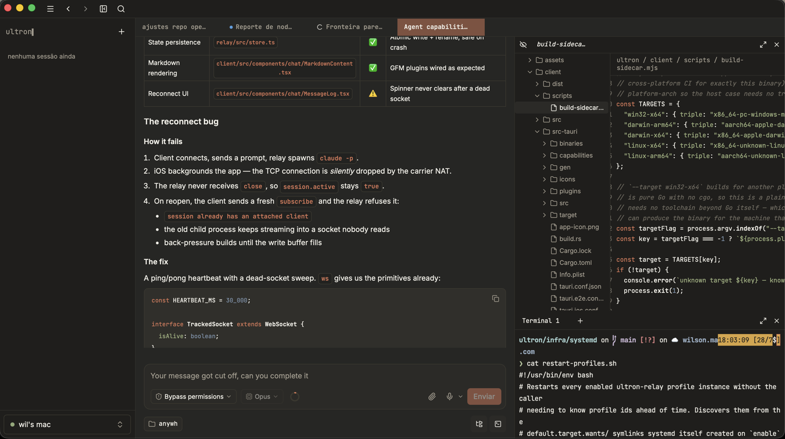

<div align="center">


# ultron

### A self-hosted remote control for your coding agents — chat, voice, and a file browser from any device, while they keep running on your own machine

**Agent-agnostic by design** — Claude Code, Codex CLI, and more

[](https://github.com/anywh-sh/ultron/actions/workflows/pr.yml)
[](LICENSE)
[](#getting-started-self-host)

[Website](https://anywh.sh) • [Getting started](#getting-started-self-host) • [Issues](https://github.com/anywh-sh/ultron/issues)

</div>

---

<p align="center">
  
</p>

A thin wrapper around the [Claude Code](https://claude.ai/code) CLI: chat, voice input, image upload, multi-session, and a file browser from a native app on desktop (Windows/macOS, Linux untested — Tauri supports it, but nobody has run it there yet) or iOS — while the actual `claude` process keeps running on a machine you control.

## Why

If you run Claude Code on a headless machine (a home server, a NAS, an always-on desktop) and connect to it over SSH from elsewhere, you lose things the official Claude apps have: voice input, drag-and-drop images, decent mobile formatting. The official apps solve that by moving your session into their own cloud — ultron doesn't. It's a relay that sits between a real client app and the real `claude` binary: the CLI keeps running on your machine, authenticated the same way it already is (OAuth/subscription, not a billed API key), and the app is just a nicer way to talk to it from any device.

## How it works

```
┌─────────────┐        WebSocket        ┌───────────┐      spawns       ┌─────────────┐
│  Client app │ ◄─────────────────────► │   Relay   │ ─────────────────►│  claude CLI │
│ (Tauri: Win/│                         │  (Node,   │                    │ (-p, one    │
│  macOS/iOS) │                         │  systemd  │                    │  process    │
└─────────────┘                         │  or CLI)  │                    │  per turn)  │
                                         └───────────┘                    └─────────────┘
```

- **Relay** (`relay/`): a Node/TypeScript server that spawns `claude -p ...` per turn, streams the JSON events back over WebSocket, and persists session/tab state to disk. No API key ever touches it — `ANTHROPIC_API_KEY` is stripped from the child process's environment on purpose, so usage always counts against your Claude plan, never pay-per-token billing.
- **Client** (`client/`): React + TypeScript + Tailwind + shadcn/ui, packaged with [Tauri 2.0](https://v2.tauri.app/) for desktop and iOS from one codebase.

## Status

Functional MVP, self-hosted and used daily by its author: chat, voice, image upload, multi-session, multi-profile, a terminal panel and a read-only file browser for the session's working directory — validated on Windows, macOS and iOS.

Setting up your own instance means pointing the client at your relay by hand (below), or implementing the [pairing protocol](./docs/pairing.md) if your relay isn't directly reachable. There's no one-command setup yet.

## Roadmap

- [x] Interactive file browser — browse, read, download, rename/delete, and open files in your editor (local or over SSH)
- [x] Multi-session and multi-profile support
- [ ] More agent CLIs — Codex CLI, Kimi CLI, and others beyond Claude Code
- [ ] Workspace isolation — per-session git worktree instead of a shared working directory, so multiple agents can work on the same repo without stepping on each other
- [ ] Direct model access (BYOK) — talk to a model API directly with your own key instead of going through a CLI, same UI and session model either way

## Getting started (self-host)

### Relay

```bash
cd relay
npm install
cp .env.example .env   # edit CLAUDE_BIN / EXTRA_PATH_DIRS if `claude` isn't on PATH
npm run build
npm start               # or `npm run dev` during development
```

By default it listens on `127.0.0.1:8765` (`RELAY_HOST`/`RELAY_PORT` in `.env.example`). It needs the `claude` CLI already installed and logged in on the same machine.

**Advanced: running it as a systemd service** (survives reboots/crashes unattended) is documented in [`infra/systemd/README.md`](./infra/systemd/README.md).

### Client

Requires the [Tauri prerequisites](https://v2.tauri.app/start/prerequisites/) for your OS (Rust toolchain + platform-specific system deps).

```bash
cd client
npm install
npm run tauri dev       # desktop app
```

By default the client points at a relay on the same machine (`127.0.0.1:8765`). There are two ways to point it at your own relay instead:

- **Build-time env var** — works on both desktop and iOS:
  ```bash
  cd client
  cp .env.example .env   # set VITE_ANYWH_HOST / VITE_ANYWH_PORT
  npm run tauri dev
  ```
- **`localStorage` override** — desktop only (needs DevTools), no rebuild required:
  ```js
  localStorage.setItem("ultron:profiles", JSON.stringify([
    { id: "default", label: "Default", host: "127.0.0.1", relayPort: 8765 },
  ]));
  ```
  then reload.

iOS has no DevTools, so an iOS build today assumes you're building from source with the env var set — see `client/README.md` for iOS-specific commands.

For a relay that isn't directly reachable (behind NAT, on a tailnet), the client can instead be pointed at it by pairing: an `ultron://import-profile` deep link, or a `<code>@<host>` code pasted under **Adicionar máquina remota** in the profile switcher. Both need the relay side to implement the endpoints in [`docs/pairing.md`](./docs/pairing.md) — the client hardcodes no server.

## Profiles

A profile is an isolated relay instance bound to one Claude Code login — not a new OS user, just a different `$HOME` the relay spawns `claude` under. The first profile is whatever you pointed the client at in [Client](#client) above; every profile after that is created from inside the app, on the same relay machine.

To add another profile once you're already connected to a relay:

1. On that machine, log into the second account once, out of band: `HOME=/path/to/new/home claude login`. This is deliberately manual and outside the app — there's no in-app login flow. A future paid tier will support logging in via `claude setup-token` (portable, no terminal); that's out of scope for the self-hosted path described here.
2. In the client, open the profile switcher and choose **Adicionar perfil** → **Criar**, give it a label and that same path, then **Verificar** to confirm the login was picked up before creating it.
3. On any other device already pointed at the same relay machine, **Adicionar perfil** → **Importar** lists the new profile automatically — one click to add it there too.

The profile registry (`~/.config/ultron/env/*.env`, `~/.config/ultron/profiles.json`) lives entirely on the relay machine — creating or importing a profile never sends anything to a third party. `infra/systemd/add-profile.sh` does the same provisioning from the command line (what the "Criar" dialog calls behind the scenes) — see [`infra/systemd/README.md`](./infra/systemd/README.md) for running it directly.

## Themes

Each profile picks its own theme, stored in the host registry next to the profile's label, so choosing one on your laptop shows up on your phone the next time it syncs.

The built-in theme ships with the app and always works, even with the relay unreachable. Custom themes are JSON files added from **Configurações → Personalização → Adicionar tema** (paste or pick a file) and live on the relay machine under `~/.config/ultron/themes/*.json`, host-wide: a theme added once is selectable from every profile on that machine.

A theme only has to declare six colors; everything else is derived from them (surface stack, faint text, terminal palette) and can be overridden token by token:

```json
{
  "version": 1,
  "id": "meu-tema",
  "name": "Meu tema",
  "appearance": "dark",
  "colors": {
    "background": "#2e3440",
    "foreground": "#eceff4",
    "muted-foreground": "#8f9bb0",
    "primary": "#88c0d0",
    "destructive": "#bf616a",
    "border": "#434c5e"
  }
}
```

The import dialog validates before saving and reports one message per field, so a broken file says exactly what's wrong. Use **Duplicar** on any theme to get its full JSON — every token spelled out — as a starting point.

## Security model

The relay has no authentication and CORS is wide open — the threat model is "trusted network" (your LAN, or a personal [Tailscale](https://tailscale.com/)/WireGuard network for remote access), not the public internet. Don't expose the relay's port directly to the internet.

This matters more than "no authentication" alone suggests: the relay's default permission mode is `bypassPermissions` (`--dangerously-skip-permissions`), so anyone who can reach the port can run arbitrary code as you, not just read your conversations.

## Remote access (outside your LAN)

Nothing here is automated — it's network setup you do once, with your own accounts, and ultron never sees it.

1. Create a personal [Tailscale](https://tailscale.com/) account (the free tier covers individual use) and install the client on the relay machine and on every device you want to connect from.
2. On the relay machine, run `tailscale ip -4` to get its tailnet address (a `100.x.y.z`).
3. Point the relay at that interface: set `RELAY_HOST` in `relay/.env` to the tailnet IP, or to `0.0.0.0` to listen everywhere. Read the [Security model](#security-model) before choosing `0.0.0.0`.
4. Point the client at that IP and port — see [Client](#client) above.

**The catch nobody mentions: the relay machine has to stay powered on and awake.** Your session lives on that machine; if it sleeps, the app has nothing to connect to. This is true on your LAN too, but it only becomes obvious once you're away from home.

## A note on `docs/NN` references

Comments across the codebase cite the project's decision history by number (`docs/08`, `docs/23`, ...). That history lives in `journal/`, one level above this repo (renamed from `docs/` in 2026-09-07, freeing up `/docs` for future real documentation, e.g. an install guide; moved out of this repo in 2026-09-08 when the workspace grew sibling private repos) — it isn't published, and the existing citations were left as-is rather than rewritten to match. The markers are provenance, not links. The comment around each one carries the actual finding.

## License

[Apache License 2.0](./LICENSE).
